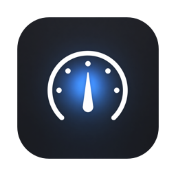

<p align="center"></p>

# bgviewer

[](https://github.com/AroraShreshth/bgviewer/actions/workflows/ci.yml)
[](https://github.com/AroraShreshth/bgviewer/actions/workflows/release.yml)


[](LICENSE)

**A tiny macOS menu-bar app that shows every background service on your machine — and can actually make them stay stopped.**

You kill a stray dev server, and two seconds later it's back. That's launchd doing its job: if a launch agent has `KeepAlive`, killing the process just tells macOS to respawn it. Months later you've got a graveyard of forgotten Python servers, updaters, and "temporary" scripts quietly running behind your Mac.

bgviewer sits in your menu bar, finds all of it, shows you where each thing comes from, and stops it **at the source**.

<p align="center"></p>

## What it shows

| Section | Source | Typical residents |
|---|---|---|
| **Auto-start Agents** | `~/Library/LaunchAgents/*.plist` | that script you wired up months ago, app updaters |
| **Machine-wide Agents** | `/Library/LaunchAgents` (all users) | vendor agents — Zoom updaters, Logitech, AV tools |
| **Homebrew Services** | `brew services` | postgres, redis, kafka, nginx |
| **Listening Processes** | anything holding a TCP port (`lsof`) | forgotten `python -m http.server`, dev servers |
| **Resource Hogs** | background processes burning CPU or RAM | that helper app quietly eating 25% CPU for days |
| **Scheduled (cron)** | `crontab -l` (read-only) | nightly scripts you set up and forgot |
| **Disabled (parked)** | agents you disabled via bgviewer | one click to bring them back — or 🗑 to Trash |

Agents that can resurrect themselves are marked **↻ auto-restart**, so you know *why* something keeps coming back. Apple system processes get a 🔒 and no destructive buttons — you can't accidentally break your Mac.

## The buttons

| | Action | What actually happens |
|---|---|---|
| ⏹ | **Stop** | Agents: `launchctl bootout` — beats `KeepAlive`, it will **not** respawn. Brew: `brew services stop`. Processes: `SIGTERM`, escalating to `SIGKILL` if ignored. |
| ⏸ | **Pause / Resume** | Freezes the process (`SIGSTOP`/`SIGCONT`) without quitting it — RAM kept, CPU freed. |
| ↻ | **Restart** | Bootout + bootstrap, `brew services restart`, or relaunch of the same command line in its original working directory. |
| 🚫 | **Disable** | Stop **and** block every future auto-start, including at login. |
| ↩ | **Re-enable** | Undo a disable, verbatim. |

Every action is verified after it runs; if something fails, the reason shows up in the footer. Nothing fails silently.

Beyond the buttons: **click a row** for details — the full command line, *Copy command*, *Reveal plist*, *View log*, and for dev servers a one-click *open localhost:port*. There's a **search box** (name, port, or command) and the list **auto-refreshes every few seconds while open**. The **⚙ Settings panel** holds **Alerts** (a notification the moment a new dev server starts listening, even while the dropdown is closed), **start at login**, and an update check — one GitHub call at most every 6 hours is the app's only network access. A green **update button** appears in the header when a newer release exists. All of this is also explained in-app — the **ⓘ** button top-left.

## How Disable works (and why it's safe)

Disable does three things:

1. `launchctl bootout` — stop it now
2. `launchctl disable` — mark it disabled in launchd's overrides
3. Moves the plist into `~/Library/LaunchAgents/Disabled by bgviewer/` — launchd never scans subdirectories, so it can't load it at login either

**Nothing is ever deleted.** Re-enable moves the plist back and bootstraps it again. If you ever stop trusting bgviewer, your plists are sitting in that folder, intact.

More guardrails:

- `com.apple.*` agents and system processes (paths under `/System`, `/usr/libexec`, …) are locked 🔒 — no action buttons at all.
- User-scope only: no admin prompt, and root daemons in `/Library/LaunchDaemons` are untouchable by design.

## Install

**Quick install** (recommended — downloads the latest release, installs to `/Applications`, launches):

```sh
curl -fsSL https://raw.githubusercontent.com/AroraShreshth/bgviewer/main/install.sh | bash
```

**Homebrew:**

```sh
brew tap arorashreshth/bgviewer https://github.com/AroraShreshth/bgviewer
brew install --cask arorashreshth/bgviewer/bgviewer --no-quarantine
```

**Manually:** download the zip from [Releases](https://github.com/AroraShreshth/bgviewer/releases), unzip, drag `bgviewer.app` to `/Applications`. The app isn't notarized yet, so macOS will block the first open — clear the flag with

```sh
xattr -d com.apple.quarantine /Applications/bgviewer.app
```

or approve it under **System Settings → Privacy & Security → "Open Anyway"** (on macOS 13–14, right-click → Open also works).

**From source** (macOS 13+, Xcode command-line tools):

```sh
git clone https://github.com/AroraShreshth/bgviewer && cd bgviewer
./build.sh
open bgviewer.app        # the gauge icon appears in your menu bar
```

Release builds are universal (Apple Silicon + Intel) and need macOS 13 Ventura or newer.

**Start at login:** System Settings → General → Login Items → add bgviewer. (Yes, an app for killing auto-started things can itself auto-start. We appreciate the irony.)

## CI & Releases

Two GitHub Actions workflows keep this honest:

- **[CI](.github/workflows/ci.yml)** — every push and PR builds the app from scratch, runs the unit-test suite, and then runs the **install smoke test** on a macOS runner: the freshly built app is zipped, installed, and launched, and must stay alive — so "it builds" always also means "it runs".
- **[Release](.github/workflows/release.yml)** — pushing a tag like `v1.0.0` automatically builds, smoke-tests, zips, checksums, and attaches the app to a GitHub Release with generated notes. A release cannot ship unless the app demonstrably launches.

## Development

```
Sources/
  BgviewerApp.swift     @main MenuBarExtra entry point
  Models.swift          service model + button-eligibility rules
  ServiceScanner.swift  discovery: launchctl / brew / lsof / ps parsing
  ServiceControl.swift  actions: stop, pause, restart, disable, enable
  ServiceStore.swift    observable state for the UI
  Views.swift           SwiftUI dropdown
  Shell.swift           subprocess runner (concurrent pipes + timeout watchdog)
Tests/main.swift        117-check test suite
build.sh                builds bgviewer.app with plain swiftc — no Xcode project
test.sh                 compiles and runs the tests
smoke-test.sh           full install loop: package → install → launch → stays up
release.sh              stamps a version, builds, smoke-tests, zips into dist/
```

No dependencies. No Xcode project. The whole build is one `swiftc` invocation.

```sh
./test.sh          # full suite, ~10s — includes integration tests that create a
                   # throwaway launch agent (com.bgviewer.selftest) and real
                   # processes against live launchd, then clean up completely
./test.sh --unit   # pure logic only; this is what CI runs
```

The integration tests are the interesting part: they spin up a real `KeepAlive` agent, stop it through the app's own code, and assert it *stays* dead — the exact failure mode this app exists to fix.

## Limitations

- User launch agents only — root daemons would need elevated rights (planned, behind an explicit prompt).
- Listening-process discovery is TCP-only.
- Restarting a loose process re-runs its command line via the shell in its original cwd — great for dev servers, not guaranteed for anything exotic.
- Not notarized yet — hence the one-time quarantine/"Open Anyway" step (Developer ID signing is planned).

## License

[MIT](LICENSE) © 2026 Shreshth Arora
