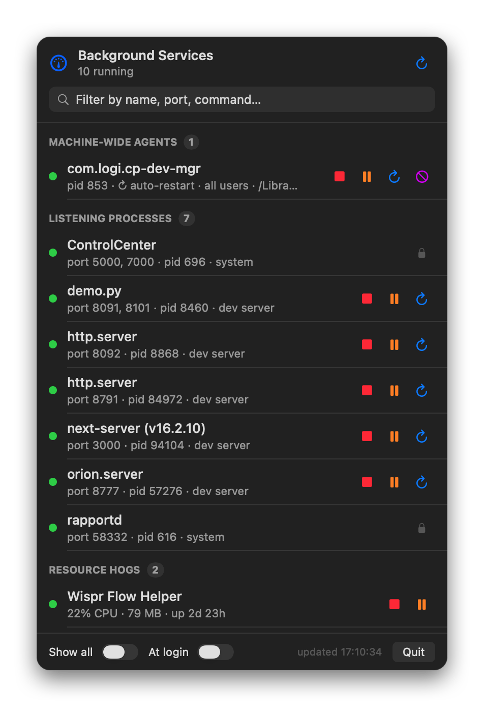

# bgviewer

**A tiny macOS menu-bar app that shows every background service on your machine — and can actually make them stay stopped.**

You kill a stray dev server, and two seconds later it's back. That's launchd: if a launch agent has `KeepAlive`, killing the process just tells macOS to respawn it. bgviewer finds these things, shows you where they come from, and stops them *at the source*.

<!-- TODO before publishing: add a real screenshot -->
<!--  -->

## What it shows

| Section | Source | Examples |
|---|---|---|
| **Auto-start Agents** | `~/Library/LaunchAgents/*.plist` | that script you wired up months ago, app updaters |
| **Homebrew Services** | `brew services` | postgres, redis, kafka, nginx |
| **Listening Processes** | anything holding a TCP port (`lsof`) | forgotten `python -m http.server`, dev servers |
| **Disabled (parked)** | agents you disabled via bgviewer | one click to re-enable |

Agents that can respawn are marked **↻ auto-restart**. Apple system processes get a 🔒 and no destructive buttons.

## The buttons

| Button | What it does |
|---|---|
| ⏹ **Stop** | Agents: `launchctl bootout` (beats `KeepAlive` — it will *not* respawn). Brew: `brew services stop`. Processes: `SIGTERM`, escalating to `SIGKILL` if ignored. |
| ⏸ **Pause / Resume** | Freezes the process (`SIGSTOP`/`SIGCONT`) without quitting it. |
| ↻ **Restart** | Bootout + bootstrap / `brew services restart` / relaunch of the same command line in its original working directory. |
| 🚫 **Disable** | Stop **and** prevent every future auto-start. |
| ↩ **Re-enable** | Undo a disable. |

If an action fails, the reason appears in the footer — nothing fails silently.

## How Disable works (and why it's reversible)

Disable does three things:

1. `launchctl bootout` — stop it now
2. `launchctl disable` — mark it disabled in launchd's overrides
3. Moves the plist into `~/Library/LaunchAgents/Disabled by bgviewer/` — launchd never scans subdirectories, so it can't load it at login either

Nothing is deleted. Re-enable moves the plist back and bootstraps it again.

## Safety

- **Never touches system things.** `com.apple.*` agents and system processes (paths under `/System`, `/usr/libexec`, …) are shown with a 🔒 and have no action buttons.
- **Everything is reversible.** No file is ever deleted — disabled agents are parked, not removed.
- **User-scope only.** bgviewer manages *your* launch agents and processes. It does not ask for admin rights and cannot touch root daemons in `/Library/LaunchDaemons`.

## Install

**From a release:** download `bgviewer-x.y.z.zip` from [Releases](../../releases), unzip, drag `bgviewer.app` to `/Applications`, then **right-click → Open** the first time (the app is not notarized; macOS requires the explicit first-open). Alternatively:

```sh
xattr -d com.apple.quarantine /Applications/bgviewer.app
```

**From source** (requires Xcode command-line tools, macOS 13+):

```sh
git clone https://github.com/OWNER/bgviewer && cd bgviewer
./build.sh
open bgviewer.app
```

**Start at login:** System Settings → General → Login Items → add bgviewer. (Yes, an app for killing auto-started things can itself auto-start. We appreciate the irony.)

## Development

```
Sources/
  BgviewerApp.swift     @main MenuBarExtra entry point
  Models.swift          service model + button-eligibility rules
  ServiceScanner.swift  discovery: launchctl / brew / lsof / ps parsing
  ServiceControl.swift  actions: stop, pause, restart, disable, enable
  ServiceStore.swift    observable state for the UI
  Views.swift           SwiftUI dropdown
  Shell.swift           subprocess runner (concurrent pipes + timeout watchdog)
Tests/main.swift        test suite (see below)
build.sh                builds bgviewer.app with swiftc — no Xcode project needed
test.sh                 compiles and runs the tests
release.sh              stamps a version, builds, zips into dist/
```

Run the tests:

```sh
./test.sh          # everything, ~10s — includes integration tests that create
                   # a throwaway launch agent (com.bgviewer.selftest) and real
                   # processes, then clean up completely
./test.sh --unit   # pure logic only; what CI runs
```

## Limitations

- User launch agents only — root daemons (`/Library/LaunchDaemons`) would need elevated rights and are out of scope for now.
- Listening-process discovery is TCP-only.
- Restarting a loose process re-runs its command line via the shell in its original cwd — good for dev servers, not guaranteed for anything exotic.
- Not signed/notarized out of the box (see Install).

## License

[MIT](LICENSE)
